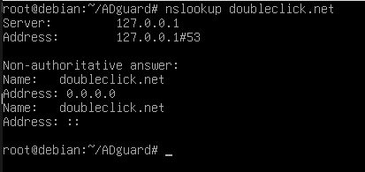
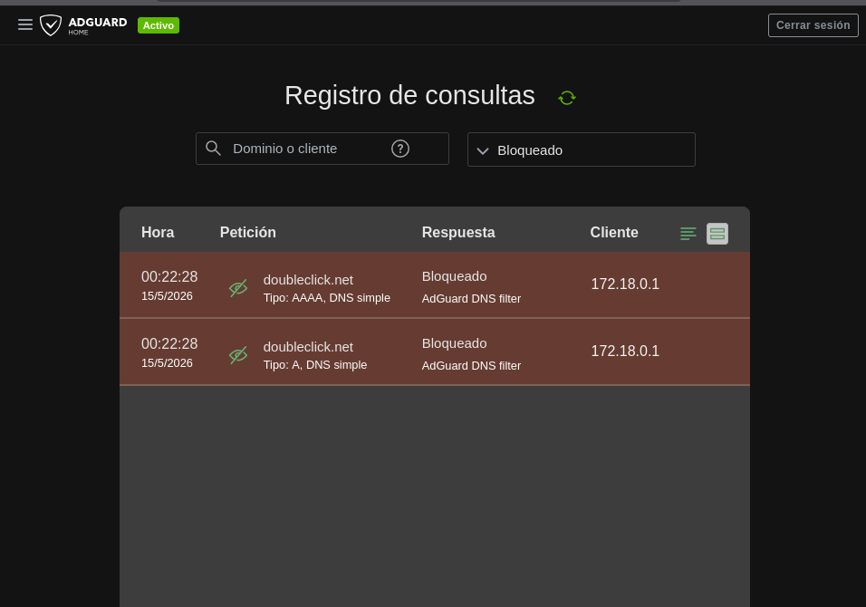

# Pràctica 0378: Tallafocs - Desplegament d'AdGuard Home

Aquest projecte documenta el desplegament d'**AdGuard Home** com a filtre DNS utilitzant Docker Compose en un entorn Debian 13. AdGuard Home actua com un servidor DNS que bloqueja anuncis i rastrejadors a nivell de xarxa.

## 🚀 Requisits i Entorn
- **SO:** Debian 13 (Trixie)
- **IP del Servidor:** 192.168.1.135
- **Eines:** Docker, Docker Compose

## 🛠️ Desplegament amb Docker Compose

S'ha utilitzat el següent fitxer `docker-compose.yml` per a aixecar el servei:

```yaml
services:
  adguardhome:
    image: adguard/adguardhome
    container_name: adguardhome
    restart: unless-stopped
    volumes:
      - ./workdir:/opt/adguardhome/work
      - ./confdir:/opt/adguardhome/conf
    ports:
      - "53:53/tcp"
      - "53:53/udp"
      - "80:80/tcp"
      - "3000:3000/tcp"
    networks:
      - adguard_net

networks:
  adguard_net:
    driver: bridge
```

### Passos per a l'execució:
1. Crear el directori del projecte: `mkdir ADguardCarlos && cd ADguardCarlos`
2. Crear el fitxer `docker-compose.yml`.
3. Executar el contenidor:
   ```bash
   docker compose up -d
   ```

## ⚙️ Configuració en Debian 13

Per a utilitzar AdGuard Home com a DNS principal en el propi servidor Debian, cal seguir aquests passos:

### 1. Desactivar systemd-resolved (si està actiu)
Debian sol utilitzar `systemd-resolved`, que ocupa el port 53. Per a alliberar-lo per a AdGuard:
```bash
systemctl stop systemd-resolved
systemctl disable systemd-resolved
```

### 2. Configurar el fitxer /etc/resolv.conf
Edita el fitxer i apunta a la IP local:
```bash
echo "nameserver 127.0.0.1" > /etc/resolv.conf
```

> [INSERTA CAPTURA AQUÍ: Configuració DNS de l'equip]

## 📊 Guia d'Operació i Proves

### 1. Accés al Panell d'Administració
Accedeix a `http://192.168.1.135:3000` per a la configuració inicial. Després de configurar-lo, el panell estarà disponible al port 80.

### 2. Activació de Llistes de Bloqueig (Blocklists)
- Ves a **Filters** -> **DNS Blocklists**.
- Prem a **Add Blocklist** -> **Choose from the list**.
- Recomanat: *AdGuard DNS filter* o *StevenBlack Unified*.

### 3. Verificació del Bloqueig
Des de la terminal, podem verificar si un domini de publicitat és bloquejat (IP 0.0.0.0):
```bash
nslookup doubleclick.net
```


### 4. Panell d'Estadístiques
Un cop el trànsit flueixi, es podrà veure el resum de consultes bloquejades.


## 📝 Justificació de Decisions

### Llistes de Filtrat
S'ha optat per la llista **AdGuard DNS filter** per la seva gran taxa d'actualització i baix nombre de falsos positius. És ideal per a un entorn domèstic/educatiu ja que cobreix la majoria de xarxes publicitàries i trackers sense trencar la navegació web legítima.

### Configuració de Xarxa
S'ha utilitzat una xarxa tipus `bridge` en Docker per a aïllar el servei, però exposant els ports directament al host. S'ha exposat el port 53 (TCP/UDP) per a les consultes DNS i el 3000 per al setup inicial. S'ha mantingut la persistència mitjançant volums locals per a evitar la pèrdua de logs i configuracions en cas de reiniciar el contenidor.
